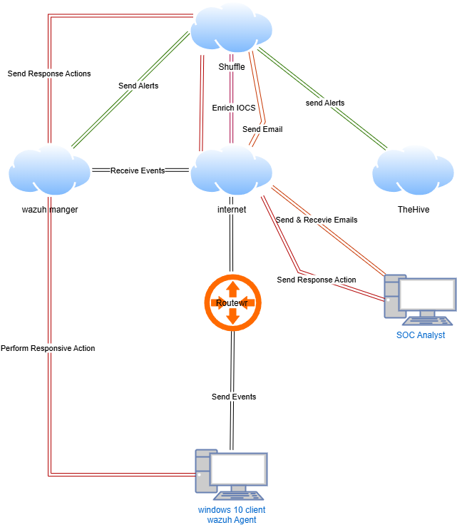

# 🛡️ SOC Automation Project – Wazuh + TheHive + Shuffle




---

## 📚 Table of Contents
- [Overview](#-overview)
- [Architecture](#-architecture)
- [Scenario](#-scenario)
- [Configuration Details](#-configuration-details)
  - [Client (Windows 10)](#-client-windows-10)
  - [TheHive Configuration](#-thehive-configuration)
  - [Wazuh Configuration](#-wazuh-configuration)
  - [Shuffle (SOAR) Automation](#-shuffle-soar-automation)
  - [Wazuh Integration with Shuffle](#-wazuh-integration-with-shuffle)
- [Active Response (Firewall Block)](#-active-response-firewall-block)
- [Workflow Summary](#-workflow-summary)
- [Acknowledgment](#-acknowledgment)

---

## 🧠 Overview

This project demonstrates how to automate **Security Operations Center (SOC)** workflows using open-source tools:  
**Wazuh (SIEM/XDR)**, **TheHive (Case Management)**, and **Shuffle (SOAR)**.  

It simulates real-world incident detection, alert enrichment, and automated response — including blocking malicious hosts directly from alerts.

---

## ⚙️ Architecture

### Tools Used
- **Wazuh** → Main **SIEM/XDR**, running in the cloud  
- **TheHive** → Primary **Case Management** platform, also cloud-hosted  
- **Shuffle** → Main **SOAR** platform for automation and integrations  

### System Setup
- **Client Machine:** Windows 10 VM  
  - Wazuh Agent installed  
  - Sysmon installed and configured for telemetry  
- **SOC Tools Host:** Ubuntu 22.04 VM (runs Wazuh, TheHive, and Shuffle)  
- **SOC Analyst Workstation:** Windows PC for monitoring alerts and emails  

📄 *Diagram: `diagram.png`*

---

## 🎯 Scenario

The simulation workflow is as follows:

1. A **Windows 10 client** executes **Mimikatz**, generating telemetry events.  
2. **Wazuh**, with a custom detection rule, identifies the activity.  
3. Wazuh sends the alert to **TheHive**, which automatically creates a case.  
4. **Shuffle** is triggered by the alert, runs enrichment actions (VirusTotal lookup), and:  
   - Sends an email notification to the SOC Analyst.  
   - Optionally triggers an **active response** to block the malicious host.

---

## 🧩 Configuration Details

### 🪟 Client (Windows 10)
- Installed **Sysmon** and **Wazuh Agent**.  
- Edited `ossec.conf`:
  - Added Sysmon full log path under `<localfile>` for log analysis.  
- Confirmed agent connectivity with the Wazuh manager.

---

### 🐝 TheHive Configuration
- **Database:** Cassandra running  
- **Search Engine:** Elasticsearch enabled  
- Created a dedicated **service account** for Shuffle integration:
  1. Added a new organization and user  
  2. Created API key for the service account  
  3. Role: `shuffle`  

---

### 🔎 Wazuh Configuration
- Enabled **Wazuh Dashboard** and **API user**.  
- Modified `ossec.conf`:
  - Set `<logall>` to `yes`.  
- Updated **Filebeat**:
  - Enabled archive logs (`archives.enabled: true`).  
- In **Dashboard → Stack Management → Index Patterns**:
  - Created new index: `wazuh-archives-*`  
  - Timestamp field: `@timestamp`

#### Custom Rule for Mimikatz Detection
Created a **custom Sysmon rule** to detect Mimikatz execution by file name.

```xml
<rule id="100002" level="15">
  <if_group>sysmon_event1</if_group>
  <field name="win.eventdata.originalFileName" type="pcre2">(?i)\\(c|w)mimikatz\.exe</field>
  <description>Mimikatz Usage Detected</description>
  <mitre>
    <id>T1003</id>
  </mitre>
</rule>
```

---

### 🧩 Custom Detection Rule

Based on `0800-sysmon_id_1` rule template.  

Even when renamed (e.g., `youareawesome.exe`), detection persisted due to Sysmon telemetry.

---

## 🤖 Shuffle (SOAR) Automation

### 🧠 Workflow Summary

When **Wazuh detects Mimikatz**:

1. **Shuffle** receives the alert via webhook.  
2. Extracts **SHA256 hash** from alert data.  
3. Queries **VirusTotal** for file reputation.  
4. Sends details to **TheHive** to create an alert.  
5. Sends an **email notification** to the SOC Analyst.

---

### ⚙️ Workflow Configuration

1. Create a **new workflow** in Shuffle.  
2. Add a **Webhook trigger** (rename it “Wazuh”) and copy its URL into the Wazuh manager integration.  
3. Use **Regex** to extract the hash:  

   ```regex
   SHA256=([0-9A-Fa-f]{64})
   ```
